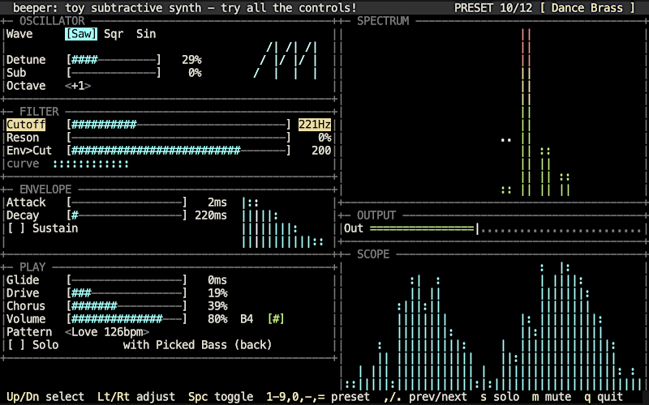

# beeper: toy subtractive synth

This is a toy synth I wrote in C for my embedded project,
[Breezybox](https://github.com/valdanylchuk/breezybox). 
The main target platform is esp32 s3/p4, the ELF app is 39kB there. 
For debugging and demo, there is also a build for Mac and web.

Play with the web version: https://mini000.itch.io/beeper

Demo video on Tanmatsu communicator (esp32-p4) - click to play:

## Feature scope: what is beeper and why?

**beeper** is an experiment in essentialism, a casual music toy, and a learning tool. Its strength is in simplicity.
If you look for a simple synth app to start learning sound synthesis, there are some great apps
and plugins out there, but they have 40-50 knobs to navigate, which can be overwhelming for a beginner.

**beeper** has only 16 controls, so about one-third the norm, carefully selected to enable a nice range of sounds without clutter.
It turned out surprisingly capable and fun to play with. It has no chord polyphony or stereo. It does support two instrument tracks plus a simple drum track for the demo loops.

The are only 12 built-in sound presets (which you can modify in any way but not save) and 12 demo sequences. No MIDI input, no user tracks or presets, no saving of results. I might build something on this basis in future, but for this experiment, that was all out of scope. The whole app is 1,800 lines in C, not counting the TUI library.

You may recognize some of the demo loops. They are only 4 bars each, reproduced definitely at hobbyist level, and the sounds do not aspire to match the originals (most cannot be matched within this feature set). As this is for educational purposes, I hope this qualifies as fair use. All rights and credit for the tunes belong to the original authors.

It turned out massive fun to play around with those loops and presets! When there are only that many controls, you adjust anything, and you often get a distict and interesting new sound. Also there are 144 combinations only from trying each preset on every loop.

## Sound controls

1. Wave shape: Saw / Square / Sine. Main oscillator shape. Saw is popular for synthpop lead sound. Square is more beepy, chiptunes-like. Sine is a clear single frequency wave, notably used for 808 style base.

2. Detune: mix in a second oscillator slightly out of tune with the main one for a sound with some light pulsing extra undertone.

3. Sub: mix in an extra square wave, for some grittier sound, or special shaping like in the octave bass preset.

4. Octave: shifts the base frequency by an octave. May make more difference in the mix flavor than you may expect just from the notes. Also fun to change up and down in a live loop for variety.

5. Cutoff: cuts off low frequencies up until a threshold. Popular live control, makes the voice go deep or high.

6. "Reson": boosts a resonating frequency, usually for a lead instrument, to make it brighter and more prominent in the mix.

7. "Env>Cut": affects the dynamics of brightness in each note. Can make it start brighter then go warmer/darker. Try how it works together with the cutoff and the envelope settings.

8. Attack: how fast the note reaches peak loudness. A few ms for dance rhythm, longer for slow-moving moody background. A major factor for the instrument's overall sound.

9. Decay: how long the note takes to gradually quiet down.

10. Sustain: make note last long at full volume. Combines two traditional sustain+release sliders into one checkbox. May be infuriating for the pros, but easy for beginners. As you see, still a nice range of sounds can work with this simplification. Big change in sound, sometimes fun.

11. Glide: make notes change smoothly into each other, intead of making steps. You can make a whistle or a siren sound this way. Big change in sound, sometimes fun.

12. Drive: A popular control. Extra boost early in the mix. Combined with the limiter, makes the instruments grittier, adding that amp buzz.

13. Chorus: a basic short chorus effect. You only control the amount mixed in.

14. Volume: the overall app volume control.

15. Pattern: you can switch to one of the 12 built-in patterns here, which will also switch to a different second instrument. Unlike actual sequencers, this app is deliberately instrument-first, not arrangement-first.

16. Solo: turn off the second instrument and the drum track to focus on how the main instrument you control sounds. Also works for fun/variety in a live loop sometimes.

## Hotkeys

**1-9,0,-,=**: Select instrument preset no. 1-12. Also turns on that instrument's default demo loop.

**Up/Down arrow keys**: Move around the sound controls

**Left/Right arrow keys**: Choose/adjust the value of a control

**Space key**: toggle a switch/checkbox control (Sustain, Solo)

**s**: solo

**m**: mute all

**q**: quit

## Licence

This is free software under MIT License. See [LICENSE](LISENSE) for details.

## Contributing

You will have a dozen great "just one more thing" ideas in the first minute of trying the app.
To me it seems like it settled in a nice self-sufficient pocket of features, and is good for what it is.
I think the best way to contribute is to clone/fork it, and build something else on top. I might do the same.

Have fun!

Web version link again: https://mini000.itch.io/beeper